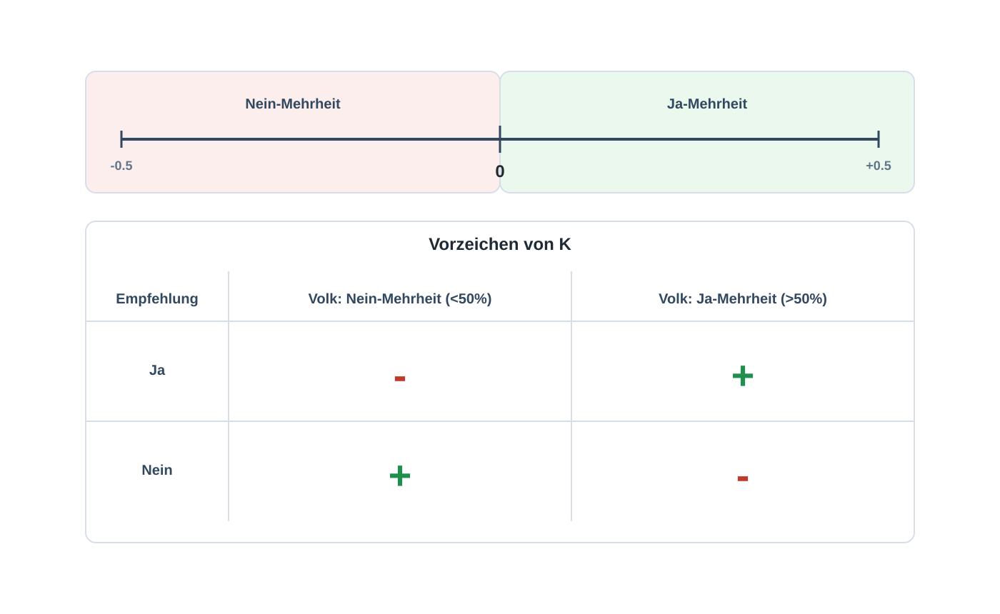

# Methodik: Wie sind wir vorgegangen?

**Datengrundlage**

Grundlage für unsere Analyse ist der Swissvotes-Datensatz, der vom Forschungszentrum Année Politique Suisse an der Universität Bern gepflegt wird. Er erfasst alle eidgenössischen Volksabstimmungen seit der Gründung des Bundesstaates 1848. Pro Vorlage sind Datum, Titel, Art der Vorlage, das Abstimmungsresultat national und kantonal sowie eine thematische Zuordnung enthalten. Auch die Abstimmungsempfehlungen von Bundesrat, Bundesversammlung und den Parteien sind erfasst.

Untersucht haben wir alle eidgenössischen Volksabstimmungen von 1848 bis Februar 2026. Insgesamt fliessen [Anzahl] Vorlagen in unsere Auswertung ein.

<strong>Hinweis:</strong> Ev. noch Version des Swissvotes-Datensatzes und Datum des Downloads ergänzen.

**Welche Akteure und welche Daten?**

Wir vergleichen sieben Akteure miteinander: Bundesrat, Bundesversammlung und die fünf grössten Parteien SP, Grüne, Mitte, FDP und SVP. Die heutige Mitte geht historisch aus der CVP hervor. Die BDP, die 2021 in der Mitte aufgegangen ist, haben wir nicht rückwirkend integriert, weil sie zuvor nach ihrer Abspaltung von der SVP nur kurz als eigenständige Partei existierte. Die Grünen werden erst ab den 1980er Jahren als nationale Kraft sichtbar, davor liegt schlicht keine Empfehlung vor. Die GLP haben wir als noch junge Partei nicht in den Vergleich aufgenommen. Kleinere Parteien sowie parteilose Politikerinnen und Politiker bleiben ebenfalls aussen vor.

Aus den Swissvotes-Daten verwenden wir drei Dinge. Für die Abstimmungsresultate den nationalen und die kantonalen Ja-Anteile. Für die Empfehlungen die Position jedes der sieben Akteure pro Vorlage. Für die thematische Auswertung die Hauptgruppen-Zuordnung, die Swissvotes für jede Vorlage vornimmt.

<strong>Hinweis:</strong> Empfehlungscodes von Swissvotes (Ja, Nein, Stimmfreigabe etc.) und Zuteilung beschreiben.

**Der Kongruenzwert**

Um vergleichen zu können, wie nah ein Akteur am Volksentscheid liegt, brauchten wir eine Kennzahl, die zwei Dinge gleichzeitig erfasst. Erstens: Hat der Akteur richtig empfohlen, also auf der gleichen Seite gestanden wie die Mehrheit? Zweitens: Wie klar war das Resultat? Eine knappe 51-Prozent-Mehrheit sagt etwas anderes aus als eine deutliche 75-Prozent-Mehrheit. Diese Kennzahl nennen wir Kongruenzwert.

Die Idee dahinter ist einfach. Eine Vorlage wird angenommen, wenn mehr als 50 Prozent der Stimmen Ja sagen, und abgelehnt, wenn es weniger sind. Die 50-Prozent-Marke ist also der Drehpunkt. Wir nehmen den Abstand zu dieser Marke als Mass: je weiter weg von 50 Prozent, desto klarer das Resultat. Aus diesem Abstand wird der Kongruenzwert. Liegt eine Empfehlung auf der gleichen Seite wie das Resultat, ist der Wert positiv. Liegt sie auf der gegenteiligen Seite, ist er negativ.

Für jede Vorlage <em>v</em> und jeden Akteur <em>i</em> berechnen wir den Kongruenzwert
<em>Kiv</em> auf Basis des nationalen Ja-Anteils
<em>Jav</em>.

  <em>Kiv = siv &middot; (Jav &minus; 50) / 100</em>

mit:

<em>Jav</em>: Ja-Anteil der Stimmbevölkerung 
<em>siv</em> = +1 bei befürwortender Empfehlung 
<em>siv</em> = &minus;1 bei ablehnender Empfehlung 
<em>siv</em> = 0 bei fehlender oder neutraler Position

So lässt sich der Wert lesen:

<em>K</em> &gt; 0: Empfehlung lag richtig 
<em>K</em> &lt; 0: Empfehlung lag falsch 
|<em>K</em>|: wie deutlich das Resultat ausfiel 
Wertebereich: zwischen &minus;0.5 und +0.5

Ein Beispiel: Empfiehlt eine Partei Ja und die Vorlage wird mit 60 Prozent angenommen, ergibt sich ein Kongruenzwert von +0.10. Empfiehlt die Partei Nein bei gleichem Resultat, liegt sie auf der falschen Seite und der Wert ist &minus;0.10. Bei einer knappen 51-Prozent-Mehrheit wären die Werte entsprechend kleiner, weil das Resultat weniger eindeutig ist.

<strong>D0:</strong> Schematische Logik des Kongruenzwerts

<strong>Lesehilfe:</strong> Die Grafik zeigt die Vorzeichenlogik des Kongruenzwerts. Ob ein Wert positiv oder negativ ist, ergibt sich aus dem Zusammenspiel von Mehrheitsentscheidung und Empfehlung.

Das Ständemehr berücksichtigen wir nicht. Der Kongruenzwert misst ausschliesslich die Übereinstimmung mit dem Volksmehr. Bei Vorlagen, bei denen Volk und Stände unterschiedlich entschieden haben, fällt diese zweite Dimension also weg.

**Umgang mit fehlenden Empfehlungen**

Nicht jeder Akteur hat zu jeder Vorlage eine Empfehlung abgegeben. Manche Parteien existierten zum Zeitpunkt einer Abstimmung noch nicht, andere haben bewusst Stimmfreigabe beschlossen oder gar keine Position bezogen. Wir behandeln solche Fälle als fehlenden Wert (NaN). Sie fliessen nicht in den Kongruenzwert ein und verzerren das Ergebnis daher nicht.

**Vorgehen Schritt für Schritt**

Die Analyse haben wir in drei Schritten aufgebaut. Zuerst haben wir den Kongruenzwert über die Zeit angeschaut, also für jeden Akteur die Entwicklung seit 1848. Die zeitliche Perspektive bildete den Ausgangspunkt, weil sich Verschiebungen am ehesten als Verlauf erkennen lassen.

In einem zweiten Schritt haben wir Epochen gebildet. Statt vorgegebene historische Periodisierungen zu übernehmen, leiteten wir die Phasen aus den Daten selbst ab. Dort, wo sich die Kongruenzwerte über mehrere Akteure hinweg stabil verhielten, sahen wir eine Epoche. Dort, wo das Muster kippte, einen Übergang. So entstanden fünf Phasen. Anschliessend haben wir geprüft, ob sich diese Einteilung mit der historischen Forschung deckt.

In einem dritten Schritt haben wir die geografische und die thematische Analyse jeweils entlang dieser Epochen aufgebaut. Wir vergleichen Kantone und Themenfelder also nicht über knapp 180 Jahre gemittelt, sondern epochenweise. Das macht strukturelle Verschiebungen sichtbar, die ein Gesamtdurchschnitt verwischen würde.

**Werkzeuge und Code**

Die Auswertung haben wir mit Python umgesetzt. Für die Datenaufbereitung kam vor allem *pandas* zum Einsatz, für die interaktiven Visualisierungen *Plotly*, für statische Grafiken *Seaborn*. Gearbeitet haben wir in Jupyter Notebooks. Den vollständigen Code samt aller verwendeten Pakete findest du in unserem Repository [Link].
