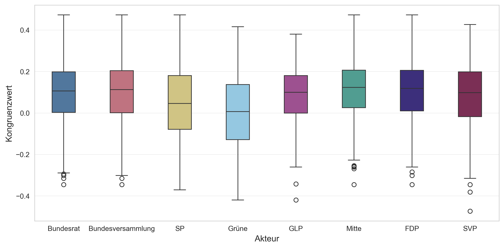

## Seit wann gibt es Abstimmungsempfehlungen?
Nun beeinflusst aber nicht nur das Volk den Gesetzgebungsprozess – auch Bundesrat, Parlament und Parteien prägen die Haltung der Stimmbevölkerung, indem sie vor Abstimmungen Empfehlungen abgeben. Allerdings waren solche Positionsbezüge nicht seit der Gründung des Bundesstaates 1848 in allen drei Institutionen verankert. Bevor wir später untersuchen, wie stark diese Empfehlungen mit dem Volkswillen übereinstimmen, werfen wir deshalb zunächst einen Blick auf die Entwicklung der Praxis selbst.

Die Darstellung **D1** zeigt, dass die Organe der _Bundesversammlung_ ab den 1860er-Jahren als Erste konsequent Abstimmungsempfehlungen abgaben; ihr Anteil liegt seitdem nahezu durchgehend bei 100 Prozent. Der _Bundesrat_ folgte ab den 1870er-Jahren, beschränkte sich dabei aber lange auf fakultative Referenden: Bei obligatorischen Referenden – bis 1874 die einzige Abstimmungsform auf Bundesebene – äusserte er sich bis in die 1970er-Jahre nicht offiziell. Seine ersten Empfehlungen überhaupt fallen deshalb auf 1875, ein Jahr nach Einführung des fakultativen Referendums, als mit den Bundesgesetzen zum Zivilstand und zur politischen Stimmberechtigung die ersten beiden Vorlagen dieser Art vors Volk kamen. Die _Bundesparteien_ begannen – sofern sie bereits existierten – erst in den 1890er-Jahren mit Empfehlungen: Den Anfang machte die SP 1891 beim Pensionsgesetz, 1893 folgte die FDP bei der Initiative für ein Schächtverbot und 1920 die CVP beim Gesetz zur Ordnung des Arbeitsverhältnisses. Der Anteil der Abstimmungsempfehlungen durch die Parteien schwankte in den folgenden Jahrzehnten, lag aber durchgehend über 95 Prozent. Die Schwankungen ergeben sich daraus, dass Parteien häufiger als Bundesrat und Bundesversammlung Stimmfreigabe beschlossen. Insgesamt zeigt sich eine zunehmende Institutionalisierung: Während in der Frühphase des Bundesstaates noch nicht alle Akteure systematisch Position bezogen, ist dies heute bei praktisch jeder Vorlage der Fall.

<strong>Methodik</strong>

Hier kommt die Methodik-Beschreibung rein (fehlt noch). Inbesondere Kongruenzwert und Auswahl der Institutionen erkläutern
**Manuel verantwortlich**

<strong>D1:</strong> Anteil abgegebener Empfehlungen pro Jahrzehnt

<strong>Lesehilfe:</strong> Diese Darstellung zeigt, wie hoch der Anteil Abstimmungsempfehlungen der unterschiedlichen Akteure in den vergangenen Jahrzehnten war.
FIXES: Änderungen an der Grafik, die noch nicht in die Abgabe geflossen sind: Jahreszahlen haben lücken

## Eine erste Übersicht: Mit wem stimmt die Stimmbevölkerung am stärksten überein?

Die Darstellung **D2** zeigt, wie stark die Empfehlungen verschiedener politischer Akteure mit dem effektiven Abstimmungsergebnis übereinstimmen.

Bundesrat und Bundesversammlung liegen sehr nahe beieinander: Der Median des Kongruenzwerts liegt bei beiden Akteuren bei rund 0.1, und auch die Streuung der Werte ist vergleichbar nahe beieinander. Hinzu kommt, dass die beiden Akteure seit [Jahr] bei praktisch jeder Vorlage dieselbe Empfehlung abgeben – institutionelle Differenzen zwischen Exekutive und Legislative schlagen sich in den Abstimmungsempfehlungen also kaum mehr nieder.

Bei den Parteien zeigt sich ein Muster entlang der politischen Achse. Die Mitte (0.11), die FDP (0.11), die SVP (0.09) und die GLP (0.08) erreichen einen höheren medianen Kongruenzwert als die SP (0.05) und die Grünen (0.05). Ihre Empfehlungen stimmen also über alle Vorlagen hinweg stärker mit den Volksentscheiden überein – sei es, weil sie öfter auf der Gewinnerseite stehen, deutlicher gewinnen oder bei stark mobilisierenden Abstimmungen besser liegen. Die beiden linken Parteien finden sich entsprechend überdurchschnittlich oft oder deutlich in der Minderheit. Die Streuung ist bei allen Parteien deutlich grösser als bei Bundesrat und Bundesversammlung: Einzelne Parteien stehen bei manchen Vorlagen weit von der Mehrheitsmeinung entfernt und liegen bei anderen klar vorne, während sich Bundesrat und Bundesversammlung konstant im Bereich moderater Übereinstimmung bewegen.

Auffällig sind die Vorlagen mit Werten unter -0.3. Sie markieren Vorlagen, in denen ein Akteur eine deutlich andere Empfehlung abgegeben hat, im Vergleich zur späteren Volksmehrheit. Solche Kongruenzwerte treten häufiger bei den Polparteien – also SP, Grüne und SVP – auf als bei den Parteien der Mitte oder bei Bundesrat und Bundesversammlung.

Insgesamt liegen Bundesrat und Bundesversammlung systematisch näher am Volksentscheid als die meisten Parteien. Unter den Parteien finden sich die Empfehlungen der bürgerlichen und liberalen Mitte – Die Mitte und FDP – am häufigsten in der Mehrheit, jene der Linken am seltensten.

<strong>D2:</strong> Kongruenzwert nach Institution

**Hinweis Grafik: Im Methodenteil wird er Kongruenzwert genau beschrieben.**

<strong>Lesehilfe:</strong> Die Boxplots zeigen die Verteilung des Kongruenzwerts pro Akteur über alle Abstimmungen seit 1848. Der Kongruenzwert misst, wie stark die Empfehlung eines Akteurs mit dem Abstimmungsergebnis übereinstimmt, gewichtet mit der Stimmbeteiligung. 
<em>Quelle: Eigene Berechnung auf Basis von Swissvotes (Stand 2025).</em>

## Literaturverzeichnis

Degen, B. (2011). Referendum. In *Historisches Lexikon der Schweiz (HLS)*. https://hls-dhs-dss.ch/de/articles/010387/2011-12-23/

Ineichen, A. (2005). Initiative. In *Historisches Lexikon der Schweiz (HLS)*. https://hls-dhs-dss.ch/de/articles/027466/2005-10-13/

Milic, T., Rousselot, B. & Vatter, A. (2014). *Handbuch der Abstimmungsforschung*. NZZ Libro.