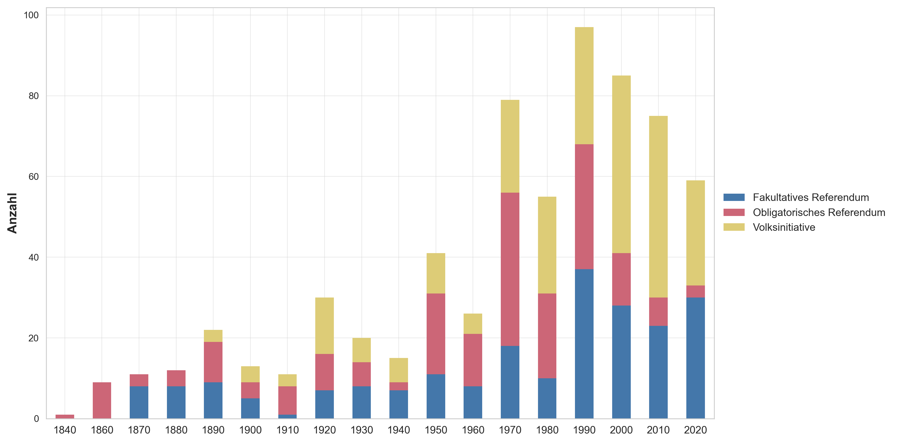
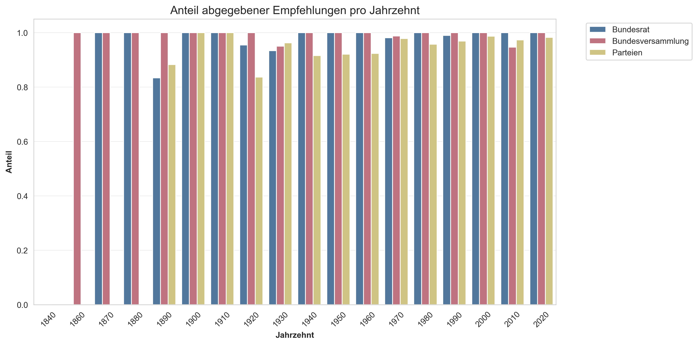

## Entwicklung über die Zeit
Politische Akteure verlieren und gewinnen über die Zeit an Einfluss – sei es, weil sich ihre Wählerbasis verändert oder weil andere Themen auf die politische Agenda rücken. In diesem Abschnitt zweigen wir auf, wie kongruent die Positionen einzelner Akteure mit den Volksentscheiden im Zeitverlauf entwickelt hat. 

<strong>Wie oft gehen Herr und Frau Schweizer abstimmen?</strong>

Wer heute in der Schweiz stimmberechtigt ist, entscheidet auf Bundesebene rund alle drei Monate über drei bis vier Vorlagen. Das war nicht immer so. Die Darstellung **D3** zeigt, wie häufig Herr und – seit 1971 – auch Frau Schweizer über Bundesvorlagen abgestimmt haben.
Auffällig ist, dass die heutige Abstimmungsfrequenz das Resultat eines schrittweisen Anstiegs ist. In den ersten Jahren des Bundesstaates gab es teilweise jahrelang keine Volksabstimmungen auf Bundesebene. Dies ist auch darauf zurückzuführen, dass nicht alle direktdemokratischen Instrumente von Beginn weg etabliert waren und sie noch nicht den gesellschaftlichen Stellenwert hatten, den sie heute geniessen. [^3]
Eine erste Zunahme zeigt sich in den 1890er-Jahren, als erstmals mehr als 20 Vorlagen pro Jahrzehnt zur Abstimmung kamen. Dieser Peak fällt mit der Verfassungsrevision von 1891 und der Einführung der Volksinitiative auf Verfassungsstufe zusammen, durch die das Stimmvolk neu auch selbst Verfassungsänderungen anstossen konnte.[^7]
Eine zweite Zunahme folgt in den 1920er-Jahren, den turbulenten Nachkriegsjahren rund um den Landesstreik von 1918. Im Vordergrund stand der Disput zwischen Unternehmern und Arbeiterschaft, der über Bundesgesetze zu Arbeitsrecht und Sozialversicherungen vors Volk gelangte.[^8]
Der dritte und nachhaltigste Anstieg setzt in den 1970er-Jahren ein. Mit der Einführung des Frauenstimmrechts 1971 verdoppelte sich die Zahl der Stimmberechtigten, gleichzeitig kamen neue Themen wie Gleichstellung, Schwangerschaftsabbruch und Umweltpolitik auf die politische Agenda. Auch die Volksinitiative entwickelte sich in diesem Jahrzehnt zu einem regelmässig genutzten Instrument: Während zwischen 1891 und 1930 nur 25 Volksinitiativen zur Abstimmung kamen, waren es seit den 1970er-Jahren in jedem Jahrzehnt über 60 (Hinweis: 2020er Jahren laufen noch).[^9]

<strong>D3:</strong> Anzahl Abstimmung nach Rechtsformen

<strong>Lesehilfe:</strong> Diese Darstellung zeigt, wie viele Abstimmungen in den vergangenen Jahrzehnten stattgefunden haben und welche Rechtsform sie hatten.

## Seit wann gibt es Abstimmungsempfehlungen?

Nun beeinflusst aber nicht nur das Volk den Gesetzgebungsprozess – auch Bundesrat, Parlament und Parteien prägen die Haltung der Stimmbevölkerung, indem sie vor Abstimmungen Empfehlungen abgeben. Allerdings waren solche Positionsbezüge nicht seit der Gründung des Bundesstaates 1848 in allen drei Institutionen verankert. Bevor wir später untersuchen, wie stark diese Empfehlungen mit dem Volkswillen übereinstimmen, werfen wir deshalb zunächst einen Blick auf die Entwicklung der Praxis selbst.

Die Darstellung **D1** zeigt, dass die Organe der _Bundesversammlung_ ab den 1860er-Jahren als Erste konsequent Abstimmungsempfehlungen abgaben; ihr Anteil liegt seitdem nahezu durchgehend bei 100 Prozent. Der _Bundesrat_ folgte ab den 1870er-Jahren, beschränkte sich dabei aber lange auf fakultative Referenden: Bei obligatorischen Referenden – bis 1874 die einzige Abstimmungsform auf Bundesebene – äusserte er sich bis in die 1970er-Jahre nicht offiziell. Seine ersten Empfehlungen überhaupt fallen deshalb auf 1875, ein Jahr nach Einführung des fakultativen Referendums, als mit den Bundesgesetzen zum Zivilstand und zur politischen Stimmberechtigung die ersten beiden Vorlagen dieser Art vors Volk kamen. Die _Bundesparteien_ begannen – sofern sie bereits existierten – erst in den 1890er-Jahren mit Empfehlungen: Den Anfang machte die SP 1891 beim Pensionsgesetz, 1893 gaben FDP und CVP ihre jeweils erste Empfehlung ab – beide zur Initiative für ein Schächtverbot. Während die FDP danach regelmässig Empfehlungen abgab, beteiligte sich die CVP erst ab 1905 wieder an der Empfehlungspraxis. Der Anteil der Abstimmungsempfehlungen durch die Parteien schwankte in den folgenden Jahrzehnten, lag aber durchgehend über 95 Prozent. Die Schwankungen ergeben sich daraus, dass Parteien häufiger als Bundesrat und Bundesversammlung Stimmfreigabe beschlossen. Insgesamt zeigt sich eine zunehmende Institutionalisierung: Während in der Frühphase des Bundesstaates noch nicht alle Akteure systematisch Position bezogen, ist dies heute bei praktisch jeder Vorlage der Fall.

<strong>Methodik</strong>

Hier kommt die Methodik-Beschreibung rein (fehlt noch). Insbesondere Kongruenzwert und Auswahl der Institutionen erläutern.

<strong>D1:</strong> Anteil abgegebener Empfehlungen pro Jahrzehnt

<strong>Lesehilfe:</strong> Diese Darstellung zeigt, wie hoch der Anteil Abstimmungsempfehlungen der unterschiedlichen Akteure in den vergangenen Jahrzehnten war.

## Übereinstimmung im Zeitverlauf

Wie wir im vorherigen Abschnitt gesehen haben, etablierte sich die Praxis der Abstimmungsempfehlungen zwischen 1848 und 1900 schrittweise. Die Darstellung **D4** zeigt, wie sich die Übereinstimmung zwischen diesen Empfehlungen und den Volksentscheiden über die Zeit entwickelt hat.

<strong>D4:</strong> Entwicklung des Kongruenzwerts nach Akteur über Zeit

<iframe src="blog_plots/d3_kongruenz_zeit.html" width="100%" height="500" frameborder="0"></iframe>

<strong>Lesehilfe:</strong> Der interaktive Lineplot zeigt die Positionen der untersuchten Akteure. Einerseits kann mit einem Klick oder Doppelklick auf den Namen des Akteurs auf die Legende, die Akeutre ein und ausgeblendet werden. Andereseits können die Zeitintervalle mit Klick auf die Buttons oben, zwischen einem, fünf oder zehn Jahre umgestellt werden. Die Aggregation pro Jahrzehnt glättet stichprobenbedingte Schwankungen einzelner Jahre und ermöglicht den Trendvergleich. In der 1-Jahres-Ansicht dominiert die Variabilität durch geringe Vorlagenzahl pro Jahr. Sie eignet sich zur Inspektion einzelner Abstimmungsjahre, nicht zur Trendanalyse. 
<em>Quelle: Eigene Berechnung auf Basis von Swissvotes (Stand 2025).</em>

**Frühphase (1848–1889):** Bundesrat und Bundesversammlung, die als Erste systematisch Empfehlungen abgaben, verfolgten in dieser Phase eine einfache Linie: Bei (obligatorischen) Referenden empfahlen sie meist Annahme, bei Initiativen meist Ablehnung. Auffällig ist, dass ihre Kongruenzwerte in dieser Phase teils im negativen Bereich liegen. Das heisst, ein grösserer Teil der Stimmberechtigten vertrat also häufiger eine andere Meinung als Regierung und Parlament. Die Daten zeigen, dass dies darauf zurückzufürhen ist, dass Bundesrat und -versammlung rund 57.6 Prozent der 54 Abstimmungen in dieser Zeit verloren haben. Dass der Wert beim Bundesrat noch mal tiefer liegt, ist mit Vorsicht zu interpretieren: Da er sich bei obligatorischen Referenden nicht offiziell äusserte, fliessen nur seine Empfehlungen bei den im Vergleich wenigen fakultativen Referenden und Initativen, die zu dieser Zeit stattgefunden hatten in die Berechnung ein. Der scheinbare Unterschied zur Bundesversammlung erklärt sich somit weniger aus inhaltlicher Differenz als aus einer unterschiedlichen Empfehlungspraxis. Ab 1891 kommen die ersten Parteiempfehlungen hinzu – zuerst die SP beim Pensionsgesetz, 1893 dann FDP und CVP bei der Initiative für ein Schächtverbot. Die CVP setzte danach allerdings für rund ein Jahrzehnt aus und meldete sich erst ab 1905 wieder regelmässig zu Wort. Über die ganze Frühphase hinweg sind die Kongruenzwerte aufgrund der wenigen Vorlagen pro Jahrzehnt volatil und sollten nicht überinterpretiert werden.

**Volatile Phase (1900–1949):** In der turbulten ersten Hälfte des 20. Jahrhunderts zeigte die Stimmbevölkerung eine höhere Einigkeit mit dem Bundesrat und der Bundesversammlung: der Kongruenzwert lag bis 1910 bei ca. 0.112. 

**Konsensphase (1950–1979):** Über sieben Jahrzehnte hinweg liegen die Kongruenzwerte aller Akteure eng beieinander, im Bereich von etwa 0.05 bis 0.15. Bundesrat, Bundesversammlung und die bürgerlichen Parteien bewegen sich weitgehend im Gleichschritt; auch die SP folgt diesem Korridor, tendenziell am unteren Rand. Das politische System produziert in dieser Phase mehrheitsfähige Vorlagen, und die meisten Akteure stehen mit ihren Empfehlungen auf der Gewinnerseite. **AUSSAGE PRÜFEN**

**Aufspaltung ab den 1980er-Jahren:** Das Bild ändert sich. Während Bundesrat, Bundesversammlung sowie die bürgerlichen Parteien (FDP, Mitte, SVP) auf einem Niveau um 0.10 verbleiben, brechen die Linken nach unten weg – zuerst die SP, ab den 1990ern auch die Grünen – und nähern sich der Nulllinie. Ihre Empfehlungen stimmen also seit rund vier Jahrzehnten systematisch weniger mit der Volksmehrheit überein als jene der übrigen Akteure. Die seit 2000 hinzugekommene GLP fügt sich in dieses Muster ein und liegt zwischen den beiden Polen.

**2010er-Jahre: Konvergenz auf tiefem Niveau.** Im jüngsten Jahrzehnt fallen die Kongruenzwerte aller Akteure deutlich ab und nähern sich der Nulllinie. Das deutet auf knappere Abstimmungsergebnisse hin – Entscheide werden weniger häufig von klaren Mehrheiten getragen. Aus demokratietheoretischer Sicht lässt sich diese Entwicklung als Polarisierung lesen: Die Abstimmungsresultate fallen knapper aus und somit ist sich die Stimmbevölkerung sich seltener untereinander oder auch mit den Akteuren einig und Vorlagen können entweder in die eine oder andere Richtungen kippen.[^1] **Aussage prüfen**

Insgesamt zeigt der zeitliche Verlauf, dass die Kongruenz mit dem Volkswillen kein stabiles Merkmal des politischen Systems ist, sondern sich verschiebt. Die zwei markantesten Verschiebungen sind die wachsende Distanz der linken Parteien ab den 1980ern und der breite Einbruch im jüngsten Jahrzehnt. --> **Überleitung zu thematischer Analyse**

[^1]: Diese Beobachtung beschränkt sich auf die letzten rund zehn Jahre und sollte mit Zurückhaltung interpretiert werden, da das aktuelle Jahrzehnt noch nicht abgeschlossen ist und einzelne hochpolarisierende Vorlagen das Bild verzerren können.

[^7]: Markus Bürgi: "Demokratische Bewegung", in: *Historisches Lexikon der Schweiz (HLS)*, Version von 2001 (bearbeitet am 06.01.2020). Online: https://hls-dhs-dss.ch/de/articles/017382/2020-01-06/, konsultiert am 26.04.2026.

[^8]: Bernard Degen: "Landesstreik", in: *Historisches Lexikon der Schweiz (HLS)*, Version von 2004 (bearbeitet am 09.08.2012). Online: https://hls-dhs-dss.ch/de/articles/016533/2012-08-09/, konsultiert am 21.04.2026.

[^9]: SWI swissinfo.ch: "Wie funktioniert das System der direkten Demokratie in der Schweiz?", 16.09.2025. Online: https://www.swissinfo.ch/ger/schweizer-demokratie/wie-funktioniert-das-system-der-direkten-demokratie-in-der-schweiz/88768620, konsultiert am 26.04.2026.