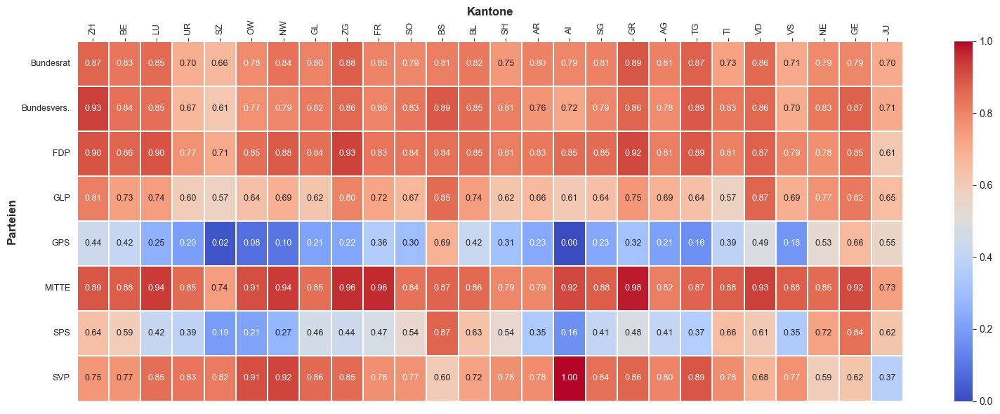

## Geografische Ausprägungen
Sowohl der Bundesrat als auch die Bundesversammlung tagen in Bern, aber zur Urne geht man überall in der Schweiz. Sowohl Bundesrat, Bundesversammlung, als auch das Konstrukt der Parteien versuchen die Schweizer Bevölkerung bestmöglich zu verkörpern. Doch wie nahe ist die Stimmbevölkerung an den Empfehlungen ihrer politischen Vertreterinnen und Vertreter aus kantonaler Perspektive? Abgeleitet aus der zeitlichen Analyse, widmen wir uns nachstehend einigen konkreten Zeitpunkten und analysieren die Kongruenz im Stimmverhalten mit geografischer Perspektive.

<strong>Wie sieht die Abstimmungskongruenz kantonal aus?</strong>

Die vorliegende Grafik zeigt den Ausprägungsgrad der Übereinstimmung zwischen summierten Abstimmungsresultaten mit den Abstimmungsempfehlungen entsprechender Institutionen. Je höher der Wert, desto grösser war die Übereinstimmung zwischen dem kantonalen Abstimmungsverhalten und den Empfehlungen der entsprechenden Institution.

Aus der Perspektive der Parteien gibt es zwei klare Pole. Während sich bei der Mitte eine grossflächige Übereinstimmung der Empfehlungen mit den Abstimmungsresultaten findet, bilden die Grünen den Gegenpol mit eher tiefen Kongruenzwerten. Aus kantonaler Betrachtung widerspiegelt sich die Poralisierung vor allem im Katon Appenzell Innerrhoden, wo die SVP mit ihren Empfehlungen im Gegensatz zu den Grünen die schweizweit höchste Kongruenz mit den Abstimmungsresultaten erzielte.

Die Bundesversammlung und auch der Bundesrat stehen alles in allem ähnlich da, wie die FDP. Einzig in den Kantonen Uri, Schwyz, Wallis und Jura liegen die Kongruenzwerte etwas tiefer. Wobei dies zugleich auch die Kantone sind, wessen Stimmbevölkerung in der Gesamttendenz am wenigsten kongruent mit den Empfehlungen der Institutionen übereinstimmt.

<strong>D3:</strong> Geografische Kongruenz Abstimmungsresultate zur Empfehlung

<strong>Lesehilfe:</strong> Diese Darstellung zeigt, wie nahe die Empfehlungen der verschiedenen Institutionen am endgülitgen Stimmresultat von 1848 bis 2020 lagen.

