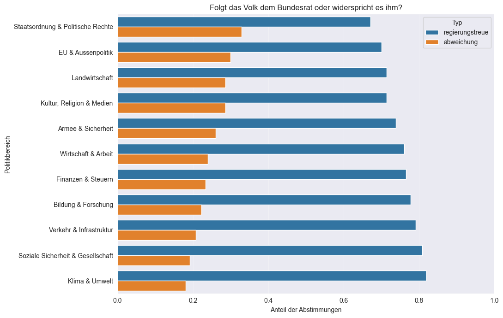
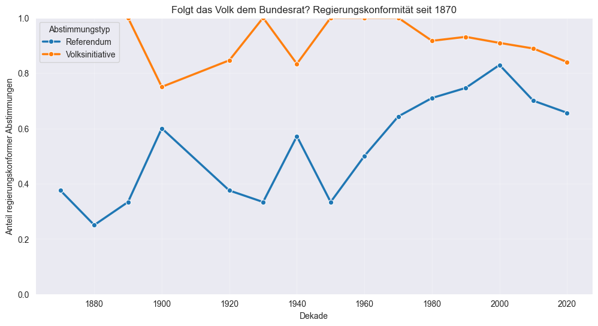

# Project Pitch: Direkte Demokratie 

**Students:** Manuel Emmenegger, Theresa Olfogo, Charlotte Schwegler  
**Project Title:** Die Schweizer Bevölkerung - eine Herde Schafe?

## Project Goal & Research Questions 

Inwiefern spiegeln eidgenössische Abstimmungsergebnisse das Vertrauen der Schweizer Stimmbevölkerung in Bundesrat und Parlament wider? Eine Analyse der Kongruenz zwischen Behördenempfehlungen und Volksentscheiden. 

### Einleitung 

- Was ist direkte Demokratie?
- Direktdemokratische Mittel
- Vertrauensbegriff (Definition)
- Erläuterung Fragestellung

### Methodologie 

- Datensatz/Datensätze 
- Variabeln 
- Untersuchungszeitraum begründen 
- Regierungskonformes Abstimmen —> Modell entwickeln/erläutern 

### Analyse 

- Zeitliche Achse:  Regierungskonformitätswerte über Zeit nach Vorlagentyp (obligatorisches Referendum, fakultatives Referendum, Volksinitiative) 
- Thematische Achse: Regierungskonformitätswerte über Themen nach Vorlagentyp (obligatorisches Referendum, fakultatives Referendum, Volksinitiative) 
- Geografische Achse? 
- Anwendung unseres Modells 

### Abgleich mit VOX/TOTO 

- Decken sich unsere Findings? 

### Diskussion und Fazit 

- Fragestellung beantworten (Wann funktioniert die Kongruenz als Vertrauensmass und wann nicht?) 
- Limitation des Ansatzes/Modells 
- Ausblick/Zukünftiges Forschungspotenzial 

## Data Sources and Literature Review 

### Literatur 

Bauer, P. C., Freitag, M. & Sciarini, P. (2019). Political trust in Switzerland: Again a special case? In J. Jedwab & J. Kincaid (Hrsg.), Identities, trust, and cohesion in federal systems: Public perspectives (S. 115–145). McGill-Queen's University Press. 

Freitag, M. & Vatter, A. (Hrsg.). (2015). Wahlen und Wählerschaft in der Schweiz. NZZ Libro. 

Kriesi, H. (2005). Direct democratic choice: The Swiss experience. Lexington Books. 

Milic, T., Rousselot, B. & Vatter, A. (2014). Handbuch der Abstimmungsforschung. NZZ Libro. 

OECD. (2024). OECD survey on drivers of trust in public institutions 2024: Country notes Switzerland. OECD Publishing. https://www.oecd.org/en/publications/oecd-survey-on-drivers-of-trust-in-public-institutions-2024-results-country-notes_a8004759-en/switzerland_b0df7353-en.html 

Sciarini, P. (2024, 5. November). Volksabstimmung: Barometer des Vertrauens. Die Volkswirtschaft. https://dievolkswirtschaft.ch/de/2024/11/volksabstimmung-barometer-des-vertrauens/  

Vatter, A. (2020). Der Bundesrat: Die Schweizer Regierung. NZZ Libro. 

Datensets 

VOX-Analysen eidgenössischer Urnengänge: Befragung von Stimmberechtigten nach eidgenössischen Abstimmungen von 1981 bis 2016; 2020 bis letzte Abstimmung. https://www.swissubase.ch/de/catalogue/studies/225/21298/overview 

## Data Visualization 
Der vorliegende Datensatz enthält 708 Beobachtungen im Zeitraum von 1848 bis 2026. Die einzelnen Beobachtungen sind in 12 Haupgruppen unterteilt, wobei sich die beiden Themengebiete Staatsordnung sowie Sozial- und Gesellschaftspolitik in der Anzahl der Beobachtungen klar abheben und gemeinsam rund 60% der Beobachtungen ausmachen. Dies entspricht rund dem fünffachen Anteil der Beobachtungen in den drei Themengebieten Energie, Bildung Forschung und Kultur, Religion, Medien, welche jeweils rund 13% der Beobachtungen ausmachen. Die Beobachtungen der beiden Kategorien Umwelt und Lebensraum sowie Energie wurden aufgrund weniger Beobachtungen in den nachfolgenden Grafiken zur Kategorie Klima und Umwelt zusammengefasst.

