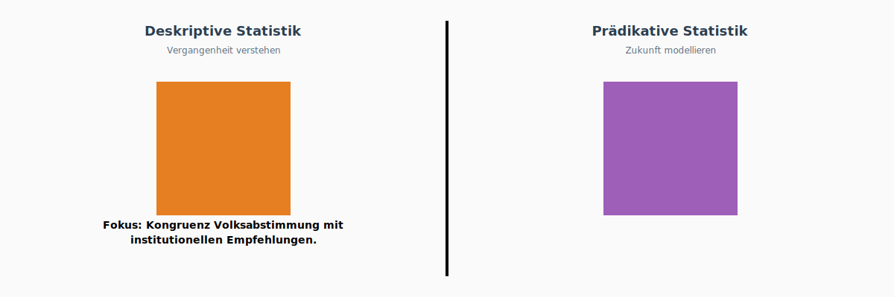
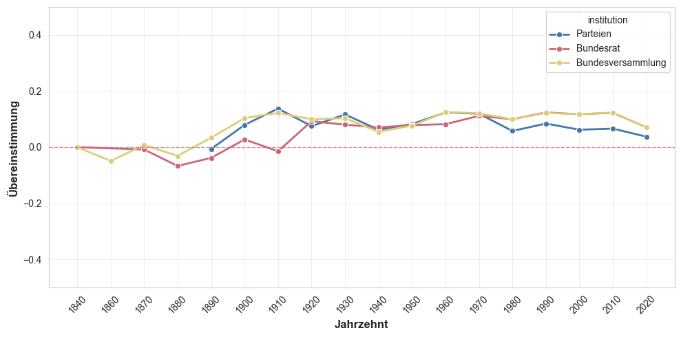
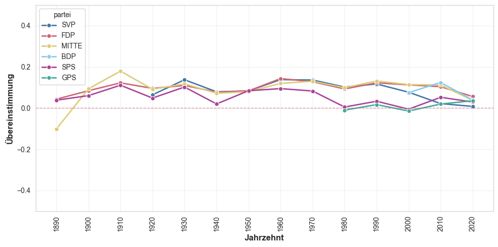
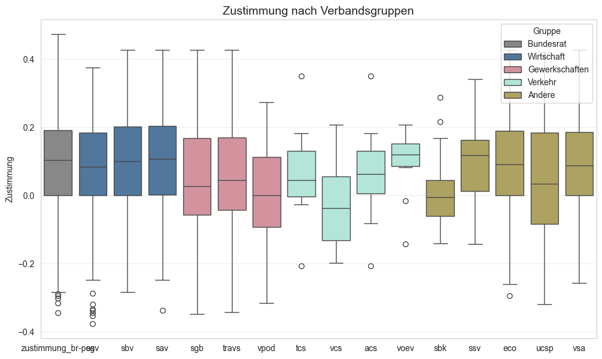
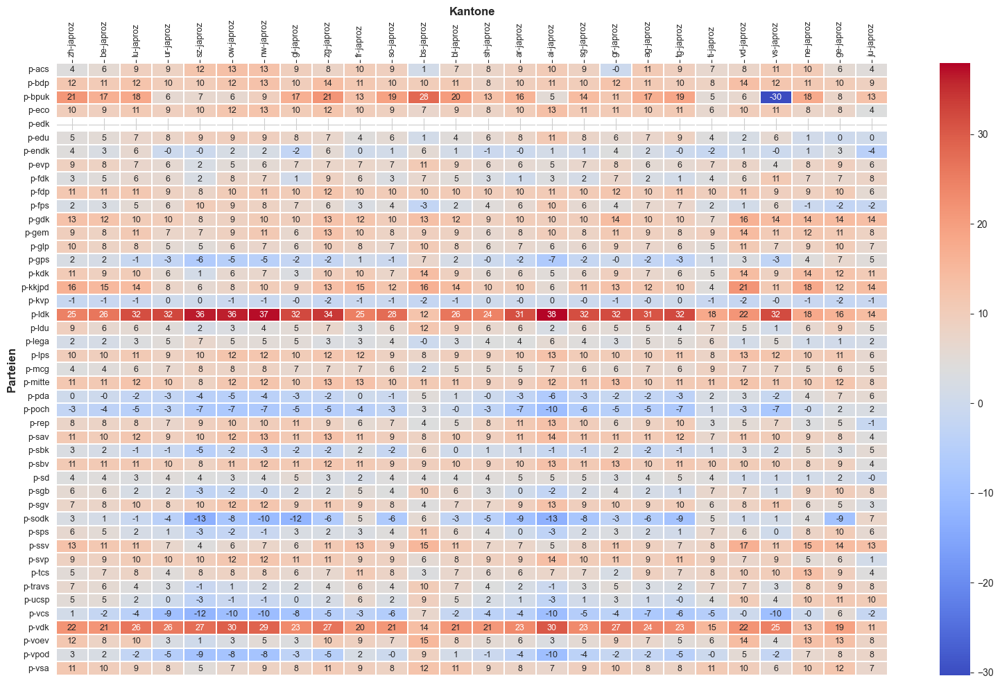

# Project Pitch: Direkte Demokratie 

**Students:** Manuel Emmenegger, Theresa Olfogo, Charlotte Schwegler  
**Project Title:** Die Schweizer Bevölkerung - eine Herde Schafe?

## Project Goal & Research Questions 

Inwiefern stimmen die Abstimmungsempfehlungen von Bundesrat, Parlament und den grossen Parteien mit der Meinung der Bevölkerung überein.

## Analyse 

- Zeitliche Achse:  Regierungskonformitätswerte über Zeit nach Vorlagentyp (obligatorisches Referendum, fakultatives Referendum, Volksinitiative) 
- Thematische Achse: Regierungskonformitätswerte über Themen nach Vorlagentyp (obligatorisches Referendum, fakultatives Referendum, Volksinitiative)
- Anwendung Zustimmungswert

Die vorliegende Grafik zeigt das Vorgehen bei der Analyse auf, nach erfolgter thematischer Recherche und Grundlagearbeit findet eine horizontale Analyse mit einzelnen Deep Dives statt. Die einzelnen Deep Dives, dargestellt als violette Punkte, dienen einer stichprobenartigen Prüfung der horizontalen Analyse. Die horizontale Analyse dient der Untersuchung der zeitlichen Achse sowie der Definition der thematischen Schwerpunkte, wobei jeweils die Haupgruppen mit grösster und kleinster Zustimmung im Zentrum stehen.

Bonus: Geografische Achse wird erarbeitet, sofern Relevanz während Projektverlauf erkannt wird.

### Fokus

### Zustimmung Bundesrat im Vergleich zu anderen Institutionen
#### Parteien und Legislative

#### Exkurs: Parteien unter sich

#### Bunderat und Verbände

### Kantonale Übereinstimmung

## Offene Fragen
### Technische Fragen
- Wir haben aktuell den Main-Branch mit einer Regel geschützt, stellen aber zugleich fest, dass diese Arbeitsweise aufwändig sein kann.
  - Wie sieht das in der Praxis aus? Wann wird ein neuer Branch angelegt, wie wird dieser bezeichnet und wie lange existiert dieser?
  - Wie sieht der Prozess aus, lädt man den main immer in den aktuellen Branch, bereinigt und merged erst dann, damit man weniger Konflikte hat?
  - Kann man Code so auschecken, dass die andere Person eine Meldung bekommt oder diesen Bereich und deren Abhängigkeiten nicht bearbeiten kann?
  - Es gibt verschiedene Arten von Merge, Squash und co. Welche machen Sinn, was ist relevant im Alltag?
  - Wir hatten immer wieder ein Durcheinander mit local, origin, remote, upstream.
- Beim Bereinigen der Merge-Conflicts haben wir auch festgestellt, dass es ziemlich mühsam ist, wenn man die Outputs mitgibt (nicht die Exports, sondern die Outpus im Notebook). Diese tauchen auch auf inkl. Anzahl Runs und erschweren den Datei-Vergleich auf Github.
- Beim anpassen unserer eigenen Bibliothek Visualisierungen.py hatten wir in den Notebooks immer wieder das Problem, dass man den Kernel neu starten musste. Ist hier der Weg mit unserem eingefügten Block der richtige Weg?
- Der Kernel braucht zum Teil in VSCode ewigs, bis er startet, gibt es hier Gründe dafür?

### Thematische Fragen
- Wir zeigen im Moment die Differenz zur 50%-Mitte auf und behalten positive und negative Werte dabei bei. Sind wir auf dem richtigen Weg?
- Die Mobilisierung konnten wir ausschliessen, die Variable fällt weg und hat keinen Einfluss.

### Fragen zur Abgabe
- Wie sollenn wir mit Tests in unserem Repo umgehen? Müssen wir bei allem Sattelfest sein für das Gespräch?